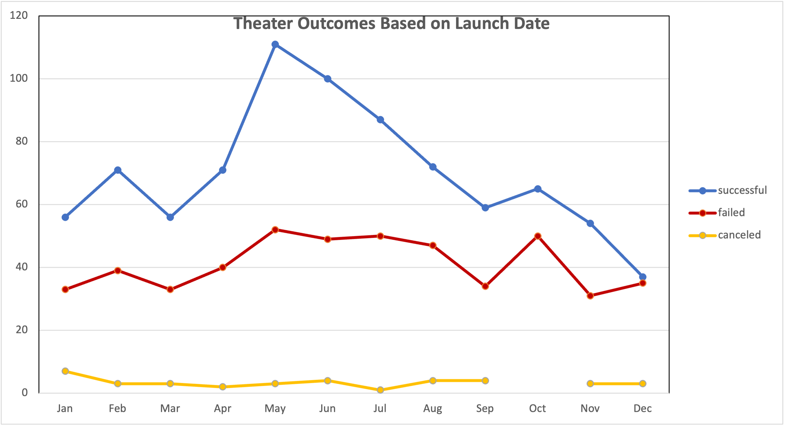
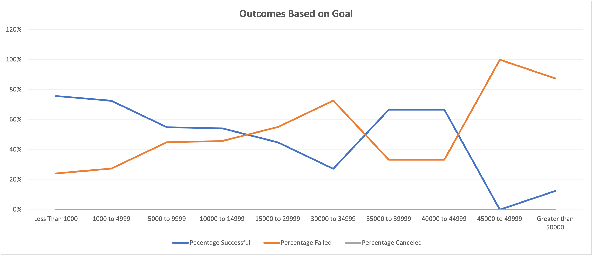

# Kickstarter Analysis

## Overview of Project

We performed the analysis of the Kickstarter dataset to uncover trends relevant to Louise's play Fever. Considering that the Fever project falls under a theater category, we decided to narrow down our dataset and look at Kickstarter historical projects in a theater category. For further narrowed down our dataset to the play sub-category to identify any relevant trends. 

## Analysis and Challenges

### Analysis of Outcomes Based on Launch Date
To identify any particular trends, we looked at the outcomes of theater fundraising projects in relation to the months when those projects were launched. For each month we determined the number of projects that succeeded, failed, and canceled. As you can see from the graph below, the highest number of successful fundraising campaigns resulted in May (111 successful projects out of 166 which is 67%) followed by June (100 successful projects out of a total of 153, which is 65%). Based on the historical information, we can conclude that May and June projects historically have been more successful compared to the rest of the months.

### Analysis of Outcomes Based on Goals
We performed further analysis of fundraising projects for the Plays subcategory based on their goal amount. For these purposes, we created dollar-amount ranges so projects can be grouped based on their goal amount. We noted that the lower is the goal amount, the higher is the percentage of successful fundraising outcomes. The ranges up to $5,000 demonstrate more than 70% of a successful outcome.

### Possible Challenges 

One of the challenges associated with creating the above graphs could be leveraging the correct data. To create the Outcome Based on Goals graph, we suggest using the Plays sub-category rather than all the categories.

## Results

According to the Analysis of Outcomes Based on Launch Date, we concluded that theater projects launched in May and June have a higher probability of a successful outcome which could also be driven by a higher number of projects that launch during this time. 

According to the Analysis of Outcomes Based on Goals, we concluded that play projects with a smaller dollar value goal (up to $5,000) have a higher chance of a successful outcome (more than 70%). 

During our analysis the following limitations of the dataset were encountered:
*	A limited number of historical data for theater campaigns that have goals that are higher than $30,000, as such high success rates for these ranges are not representative.
*	Dataset is outdated and might not be relevant for the current environment. The period covered by the dataset is 2011-2017.

We suggest that the following possible tables and/or graphs could be beneficial for further analysis:
* For Analysis of Outcomes Based on Launch Date add the percentage of outcomes rather than the number of outcomes
* Create Box and Whisker plot
* Leverage only US projects for our analysis
